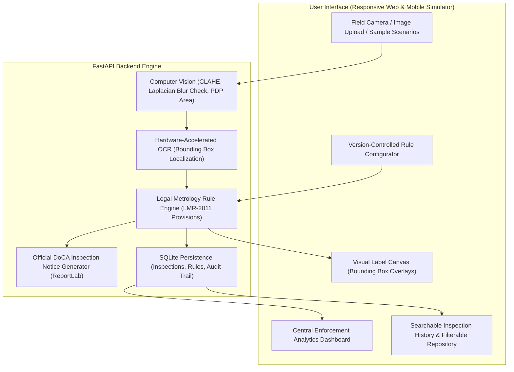

# LexMetrix — Legal Metrology Automated Compliance System

> **Problem Statement ID**: 26034  
> **Organization**: Ministry of Consumer Affairs, Food & Public Distribution  
> **Department**: Department of Consumer Affairs (DoCA)  
> **Core Workflow**: *Scan once. Analyse automatically. Validate accurately. Report digitally.*

---

## 📌 Executive Summary & Problem Context

Under the **Legal Metrology Act, 2009** and the **Legal Metrology (Packaged Commodities) Rules, 2011**, every packaged commodity sold across retail stores, supermarkets, and e-commerce platforms in India must bear mandatory declarations:
- Manufacturer / Packer / Importer name and complete address with PIN code (Rule 6(1)(a))
- Country of origin (Rule 6(1)(b))
- Net quantity declared in standard metric units (Rule 6(1)(c) & Second Schedule)
- Month and year of manufacture / packing / import (Rule 6(1)(d))
- Maximum Retail Price (MRP) explicitly stating **"(incl. of all taxes)"** and Unit Sale Price (USP) for large packages (Rule 6(1)(e))
- Consumer grievance redressal details (Designation, Address, Helpline, and Email) (Rule 6(1)(n))
- Traceability Batch / Lot number (Rule 6(1)(f))
- Minimum numeral & font height compliance based on package dimensions (Rule 5 & First Schedule)

Due to the sheer volume of packaged goods in Indian retail, manual inspection is slow, subjective, and resource-constrained. **LexMetrix** automates this entire pipeline using Computer Vision, OCR, and a statutory Rule Engine to deliver instant compliance verdicts and official PDF notices.

---

## 🏛️ Website vs. Mobile App: Dual Architecture

LexMetrix implements a **Unified Responsive Architecture**:
1. **Field Inspector Mode (Mobile / Tablet Viewport)**:
   - Optimized for enforcement officers in the field.
   - Direct camera capture (`capture="environment"`), viewfinder reticle, and instant blur quality checks.
   - Built-in on-screen **"Mobile View" simulator toggle** so evaluators can preview the smartphone inspector view directly on desktop during the pitch!
2. **Central Enforcement Command Center (Desktop Viewport)**:
   - Designed for senior officials at the Department of Consumer Affairs.
   - High-level KPI cards, district compliance analytics, rule violation distribution charts, searchable audit repository, and rule threshold configurator.

---

## ⚙️ System Architecture & Pipeline



### Statutory Pipeline:
1. **Quality Assessment & Enhancement**:
   - Laplacian variance check ($\sigma^2 < 75$) detects camera blur and rejects low-evidentiary photos.
   - Contrast Limited Adaptive Histogram Equalization (CLAHE) on the L-channel normalizes lighting and suppresses supermarket packaging glare.
2. **Declaration Extraction**:
   - Multi-pass OCR extracts word boundaries $(x, y, w, h)$ and full text lines.
   - Entity recognition parses MRP, Net Quantity, PIN codes, Dates, Consumer Care, and Batch IDs.
3. **Statutory Evaluation**:
   - Compares detected declarations against statutory mandates of Legal Metrology (PC) Rules, 2011.
   - Flags critical non-compliances (e.g. missing taxes disclaimer, prohibited unit `'gms'`).
   - Measures numeral height to verify compliance with Rule 5 First Schedule tables.
4. **Evidentiary Annotation & Reporting**:
   - Overlays color-coded bounding boxes on the original package image.
   - Generates an official Government of India styled PDF Inspection Report with statutory section references (e.g., Notice under Section 36(1) of Legal Metrology Act, 2009).

---

## 🚀 Quickstart Guide

### Prerequisites
- Python 3.10+ (Python 3.13 supported)

### Method 1: Instant Windows Batch / PowerShell Launcher (Recommended)
Simply double-click:
```bash
run.bat
```
Or run in PowerShell:
```powershell
.\run.ps1
```
The server will start at **http://127.0.0.1:8000**. Open this URL in any web browser.

### Method 2: Manual Terminal Execution
```bash
# 1. Install dependencies
pip install -r requirements.txt

# 2. Run automated test suite
python tests/test_compliance.py

# 3. Start the application server
python -m uvicorn backend.main:app --host 0.0.0.0 --port 8000 --reload
```

### Method 3: Docker Deployment
```bash
docker build -t lexmetrix .
docker run -p 8000:8000 lexmetrix
```

---

## 🎯 Pre-Loaded Demo Packaging Scenarios (For Pitch Presentation)

LexMetrix includes 5 pre-rendered high-resolution packaging scenarios accessible via 1-click on the top bar:

| Scenario | Product | Expected Status | Key Statutory Finding |
| :--- | :--- | :--- | :--- |
| **Sample 1** | Golden Bake Butter Cookies | `COMPLIANT` (100%) | Complete declarations, valid PIN, MRP with taxes disclaimer, standard SI units. |
| **Sample 2** | Crunchy Potato Chips | `NON_COMPLIANT` | **Violation of Rule 6(1)(e)**: MRP declared as `Rs. 35.00` without mandatory `(incl. of all taxes)`. |
| **Sample 3** | Super Clean Detergent | `NON_COMPLIANT` | **Violation of Rule 6(1)(c) & 2nd Schedule**: Prohibited unit symbol `500 gms` used instead of `500 g`. |
| **Sample 4** | Royal Pure Mustard Oil | `NON_COMPLIANT` | **Violation of Rule 6(1)(n) & 6(1)(a)**: Missing consumer care email address; missing postal PIN code. |
| **Sample 5** | Blurry Capture Demo | `WARNING` | **Evidentiary Check**: Laplacian blur detector alerts inspector to retake clear photo. |

---

## 📊 Evaluation & Testing Suite

Run the test suite to verify Computer Vision, OCR, Rule Engine, and PDF Generation:
```bash
python tests/test_compliance.py
```
**Results**:
- `test_01_cv_blur_detection` — PASS
- `test_02_sample1_fully_compliant` — PASS
- `test_03_sample2_mrp_tax_violation` — PASS
- `test_04_sample3_prohibited_unit_violation` — PASS
- `test_05_sample4_consumer_care_missing_email_and_pin` — PASS
- `test_06_pdf_report_generation` — PASS

---

## 📄 Statutory & Regulatory Compliance
- **The Legal Metrology Act, 2009 (Act No. 1 of 2010)**
- **The Legal Metrology (Packaged Commodities) Rules, 2011** (as amended 2017 & 2021)
- **Section 36(1)**: Penalty for selling, distributing or delivering non-standard packages (fine up to ₹25,000 for 1st offence, ₹50,000 for 2nd offence, and imprisonment for subsequent offences).
- **Section 48**: Compounding of offences.
